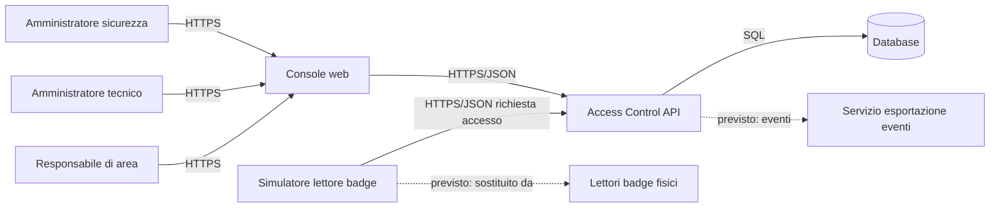

# Architettura v1 — Access Control Platform / Aurea Precision Components S.p.A.

| | |
|---|---|
| **Team** | *(nome team — da definire)* — Dario D'Alessandro, Nicolò Florean, Gianmarco Tonelli |
| **Cliente** | Aurea Precision Components S.p.A. |
| **Data** | 23/09/2026 |
| **Versione** | v1 — provvisoria per definizione, la confronterete con la v2 a dicembre |

*Questo documento è agnostico rispetto al linguaggio: lo stack (linguaggio,
framework, database) è una scelta libera del team, qui si descrivono
componenti e responsabilità, non implementazioni.*

## Componenti

| Componente | Risponde di | Non risponde di |
|---|---|---|
| **Simulatore lettore badge** | generare e inviare richieste di accesso (badge, varco, timestamp) come se provenissero da varchi reali | decidere se l'accesso è concesso |
| **Console web (frontend)** | presentare utenti, badge, aree e storico agli operatori; raccogliere l'input; mostrare gli errori | decidere chi può accedere dove |
| **Access Control API (backend)** | valutare ogni richiesta di accesso applicando le regole configurate, gestire la configurazione di utenti/badge/aree/varchi/autorizzazioni, autenticare e autorizzare gli operatori, registrare ogni tentativo | come i dati appaiono a schermo |
| **Database** | conservare in modo coerente utenti, badge, aree, varchi, autorizzazioni e storico degli accessi | le regole di autorizzazione |

*Nota: valutazione delle richieste e configurazione dei permessi restano nello
stesso componente (Access Control API) perché condividono lo stesso motivo di
cambiamento — le regole di accesso — sullo stesso modello dati; il team può
scomporle in due servizi separati in una v2 se emerge un motivo concreto
(es. scalabilità indipendente).*

## Diagramma

## Dipendenze

| Componente | Dipende da | Se si ferma |
|---|---|---|
| Console web | Access Control API | l'operatore vede un errore, nessuna configurazione viene modificata due volte |
| Simulatore lettore badge | Access Control API | il simulatore non riceve risposta; nessun accesso viene concesso per default *(comportamento fail-closed assunto, da confermare — vedi domanda #2 in `domande-cliente.md`)* |
| Access Control API | Database | il sistema non può valutare nuove richieste né mostrare lo storico; le richieste in corso falliscono in modo esplicito |

## Fuori dal perimetro

- Lettori badge fisici e relativa integrazione hardware (previsti in futuro,
  sostituiti oggi dal simulatore software)
- Sistemi di sicurezza o reporting esterni verso cui esportare gli eventi
  (integrazione futura dichiarata dal cliente, punto 8 della richiesta)
- Servizio di notifica automatica agli amministratori in caso di anomalie
  (non richiesto esplicitamente, possibile evoluzione)
