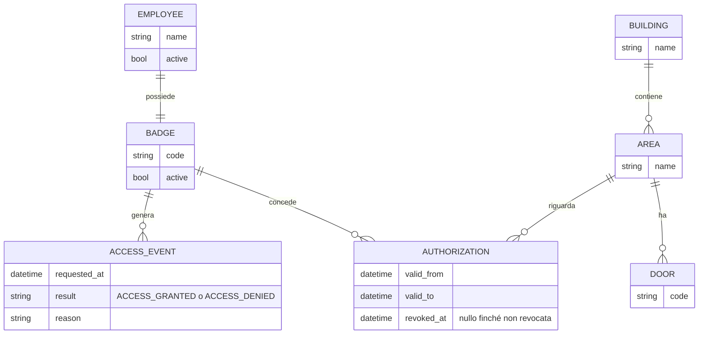

# Requisiti — Access Control Platform / Aurea Precision Components S.p.A.

| | |
|---|---|
| **Team** | *(nome team — da definire)* — Dario D'Alessandro, Nicolò Florean, Gianmarco Tonelli |
| **Cliente** | Aurea Precision Components S.p.A. |
| **Data** | 23/09/2026 |
| **Versione** | v1 |

## Problema

Aurea Precision Components gestisce i permessi di accesso alle proprie aree
(uffici, reparti produttivi, laboratori, magazzino, sala sistemi) in modo
frammentato, senza un sistema che valuti automaticamente se un badge può
accedere a un varco. Di conseguenza non è possibile garantire in modo
affidabile che solo il personale autorizzato entri nelle aree sensibili, né
ricostruire a posteriori chi ha tentato di accedere dove e quando.

## Obiettivi del progetto

- Centralizzare la gestione di utenti, badge virtuali, aree e autorizzazioni
- Automatizzare la valutazione di ogni richiesta di accesso in modo
  deterministico e coerente con i permessi configurati
- Costruire uno storico affidabile e consultabile di tutti i tentativi di
  accesso, per analisi e audit
- Predisporre l'architettura a future integrazioni con lettori badge reali e
  con più sedi/varchi

## Requisiti funzionali

| # | Requisito |
|---|---|
| RF1 | Un amministratore sicurezza può creare, modificare e disattivare utenti (dipendenti) e i relativi badge virtuali |
| RF2 | Un amministratore sicurezza può definire edifici, aree e varchi |
| RF3 | Un amministratore sicurezza può associare e revocare autorizzazioni tra un badge e un'area |
| RF4 | Il sistema riceve da un simulatore una richiesta di accesso (badge, varco, timestamp) e risponde con `ACCESS_GRANTED` o `ACCESS_DENIED` |
| RF5 | Ogni richiesta di accesso valutata, concessa o negata, viene registrata con esito e motivazione |
| RF6 | Un amministratore sicurezza può consultare e filtrare lo storico degli accessi per badge, area, varco e periodo |
| RF7 | Un responsabile di area può consultare lo storico degli accessi solo per le aree di propria competenza |
| RF8 | Il sistema evidenzia nello storico i tentativi negati o anomali |
| RF9 | Una modifica a un'autorizzazione si applica alle richieste di accesso successive, senza alterare le richieste già registrate |
| RF10 | Un responsabile di area può associare e revocare autorizzazioni tra un badge e le aree di propria competenza (non su altre aree) — *funzionalità richiesta esplicitamente dal cliente dopo la prima consegna, vedi `domande-cliente.md` #6* |

## Requisiti non funzionali

| # | Requisito |
|---|---|
| RNF1 | La valutazione di una richiesta di accesso restituisce un esito entro **5 secondi** *(soglia confermata dal cliente — vedi `domande-cliente.md` #1)*, indipendentemente dal numero di regole configurate |
| RNF2 | Le regole di autorizzazione sono separate dall'interfaccia utente e modificabili senza intervenire sul codice sorgente |
| RNF3 | Ogni operatore (amministratore sicurezza, amministratore tecnico) accede al sistema tramite autenticazione; le operazioni disponibili dipendono dal ruolo |
| RNF4 | Nessun secret o credenziale è presente nel codice sorgente |
| RNF5 | Le modifiche ai permessi sono tracciate in un audit log distinto dai log applicativi |
| RNF6 | Nessuna funzione basata su intelligenza artificiale può concedere o negare autonomamente un accesso: la decisione resta completamente deterministica e basata sulle regole configurate |
| RNF7 | L'architettura può evolvere verso più sedi ed edifici e più varchi senza richiedere un ridisegno dei componenti |

<i>✗ "Il sistema deve essere sicuro" — ✓ "Nessuna
funzione AI può autorizzare un accesso: la decisione di GRANTED/DENIED
dipende solo dalle regole configurate, verificabile per ogni richiesta"</i>

## Vincoli dichiarati dal cliente

- Nessun dispositivo fisico reale è richiesto nella fase 1: un simulatore
  software invia le richieste di accesso al posto dei lettori badge reali
- Gli identificativi dei badge devono essere dati di test
- Il cliente non impone uno specifico stack tecnologico o framework
- La dimostrazione finale deve includere utenti con permessi differenti e
  almeno più aree
- L'intelligenza artificiale è ammessa solo come supporto agli operatori
  (es. sintetizzare pattern di tentativi anomali), mai per decidere un accesso

## Modello delle autorizzazioni

*Deliverable #1 della richiesta cliente ("documento dei requisiti e modello
delle autorizzazioni"): come si relazionano le entità del glossario. Rispecchia
esattamente lo schema del database (`src/db/schema.sql`) — un badge non
autorizza direttamente su un varco, ma su un'area; è il varco a determinare
su quale area si sta chiedendo accesso. Un dipendente ha esattamente un
badge (confermato dal cliente, vedi `domande-cliente.md` #3); lo stesso badge
può però essere autorizzato su più aree contemporaneamente, se configurato
così (`domande-cliente.md` #4) — è la tabella `authorizations` a renderlo
possibile, non serve che un'area abbia più varchi o un varco più aree.*

Una richiesta di accesso è quindi valutata così: dal `varco` (codice) si
risale all'`area`; si cerca un'`autorizzazione` che leghi il `badge` a
quell'`area`, non revocata e valida al timestamp della richiesta. Se non
esiste, o se badge/varco non esistono, o se il badge è disattivato, l'esito è
`ACCESS_DENIED` — mai concesso per default (vedi RNF6 e `architecture-v1.md`).

## Glossario

| Termine | Significato |
|---|---|
| Badge | Identificativo virtuale associato a un dipendente, usato per richiedere l'accesso a un varco |
| Varco | Punto di accesso fisico a un'area (porta, tornello, ecc.), oggi simulato |
| Area | Porzione della sede (ufficio, reparto produttivo, laboratorio, magazzino, sala sistemi) su cui si applicano le autorizzazioni |
| Autorizzazione | Associazione tra un badge e un'area che ne consente l'accesso |
| Simulatore | Componente software che genera richieste di accesso come se provenissero da varchi reali |
